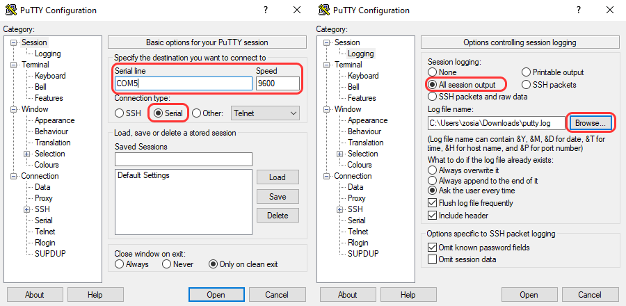

# Draft - Sensor Video

In this attempt, sensor data from gyroscope sensor was collected (yaw, pitch, roll) along with a recorded video. 

For visualization purposes, we overlay a video and graph of YPR values.

# Method

The data was collected using a gyro connected to Arduino Nano (collect_data_with_buttonjun24b.ino) and printed in serial. After each stitch, I press a button (so I can mark separate stitches later). Then I make the user wait for couple seconds and collect next stitch. Each one by one. 

For saving the data, I use PuTTY and save the session output in a log file, that I later export / edit in Excel. 

Then, I run (overlay_graph.py), try to match video frames and data entries (according to the data collectin interval set in python code and frame rate of video) and generate the graph.

# Warnings & Info

I use a video/data of single crochet, so the data is called ypr_single.csv and video_single.mp4. 

The data of video and sensor is difficult to perfectly align - since this is a draft / prototype, neither of data should be relied on, as it was not collected under ideal consideration.

Also, I included ChatGPT-improved version of my Arduino code, for memory optimization. I don't remember if it worked.
