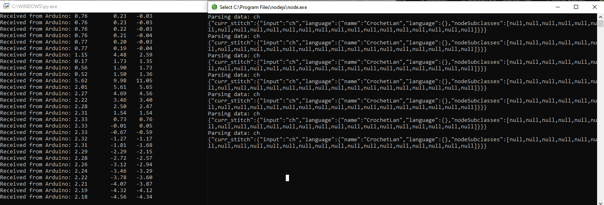

# System Communication

This system consists of three independant parts:
1. Arduino system for sensing - it reads sensor data and sends it forward using serial communication.
2. Machine Learning detection system - reads the sensor data and analyzes it in online manner. Sends forwards the detected movements.
3. Parser - reads the movement types and structurizes them into a net of correlated items.

# What is it

This folder consists of example system communication between steps 1 <-> 2 and 2 <-> 3. 

# How to run it 

## Method 1

* Upload the sensing code (gyro_readwrite.ino) to your Arduino.
* Run your python detection code (detection.py) after connecting Arduino.
```
py detection.py
```
* Run the server connected to the parser.
```
node parser_server.js
```

## Method 2

* Run bash script (run.sh)
```
./run.sh
```

That runs both detection and parser codes. Almost same as method 1.



